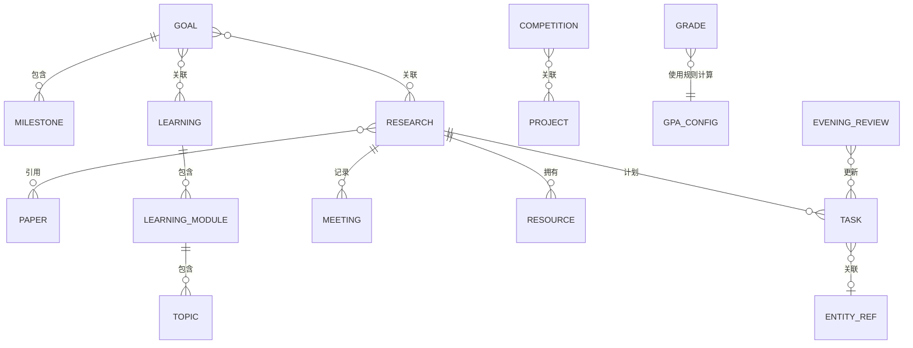

# Research OS 架构说明

Research OS 是一个本地优先的 Next.js 应用。浏览器只与本机 Node 进程通信，本地接口负责读写 `data/` 目录下可人工阅读的 JSON 文件。

## 数据模型

所有实体都使用带类型前缀的稳定 ID、ISO 8601 时间戳、标签和可选归档标记。

关系使用 `{ type, id, label? }` 保存：

- `id` 是关系判断的唯一依据。
- `type` 标记关联对象类型。
- `label` 只用于提高 JSON 和 Git 变更记录的可读性。

## 存储文件

- `data/tasks.json`：周任务、当前重点和截止日期
- `data/learning.json`：课程 → 模块 → 知识点
- `data/research.json`：科研上下文、会议、论文关系、材料与代码路径
- `data/papers.json`：手工元数据与阅读笔记；`source` 是未来 Zotero 适配边界
- `data/projects.json`：非科研个人项目和参考项目
- `data/competitions.json`：竞赛记录
- `data/goals.json`：目标、里程碑与关联对象
- `data/grades.json`：成绩记录
- `data/reviews.json`：晚间复盘历史
- `data/settings.json`：数据版本和 GPA 映射规则

## 写入策略

每次保存先写入临时文件，再原子替换正式文件。进程内写入队列用于避免多个请求同时覆盖同一个集合。

按业务集合拆分文件，相比把所有数据放入一个大文件，可以减少 Git 冲突，并让提交记录更容易阅读。

## 扩展边界

- **Zotero**：将远程条目映射到 `Paper.source`，无需改变界面使用的论文模型。
- **日历**：通过统一实体接口，将外部事件导入为带截止日期的任务。
- **AI**：未来增加独立服务适配层；当前版本没有 API Key 或 AI 依赖。
- **存储**：`createStore(root)` 将持久化与界面隔离，未来可以替换存储实现而不修改 React 页面。
