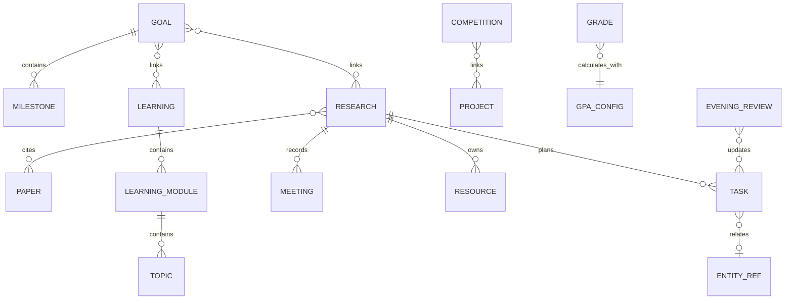

# Research OS architecture

Research OS is a local-first Next.js application. The browser talks only to the local Node process. The Node API reads and writes human-readable JSON under `data/`.

## Data model

All entities use stable prefixed IDs, ISO 8601 timestamps, tags, and an optional archive flag. Relations store `{ type, id, label? }`; the ID is authoritative and the label is only a readable hint for Git diffs.

## Storage layout

- `data/tasks.json`: weekly tasks, priorities and deadlines
- `data/learning.json`: courses → modules → topics
- `data/research.json`: research context, meetings, papers and code/material links
- `data/papers.json`: manual metadata and reading notes; `source` is the future Zotero adapter boundary
- `data/projects.json`, `competitions.json`, `goals.json`, `grades.json`
- `data/reviews.json`: evening review history
- `data/settings.json`: schema version and configurable GPA mapping

Writes go to a temporary file and are renamed into place. A process-local queue prevents overlapping writes. Splitting collections limits Git conflicts compared with one large database file.

## Extension boundaries

- Zotero: map remote items to `Paper.source` without changing the UI-facing paper model.
- Calendar: import events as deadline-bearing tasks through the entity API.
- AI: add a separate service adapter later; no API key or AI dependency exists in the MVP.
- Storage: `createStore(root)` isolates persistence from the UI and can be replaced without changing React pages.
